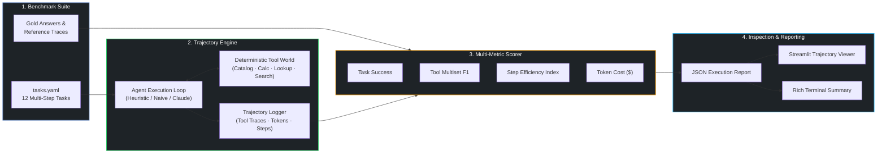
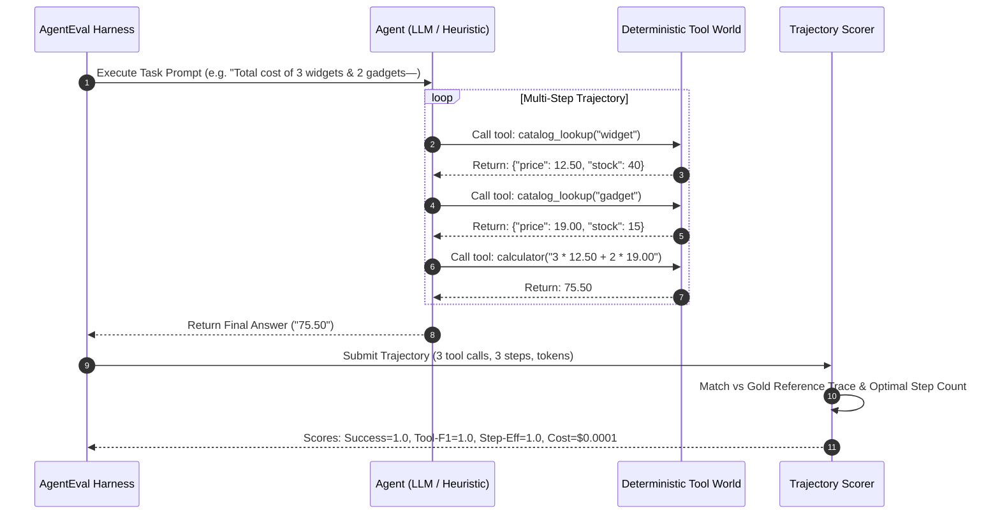

# 🧪 AgentEval — Agent Trajectory & Tool-Use Evaluation Framework

<div align="center">

[](LICENSE)
[](https://python.org)
[](.)
[](.)
[](.)
[](https://github.com/nathaniel-gordon)

<p align="center">
  <strong>Grade the entire execution trajectory of tool-calling LLM agents — tool accuracy, step efficiency, token economics, and task completion.</strong>
</p>

</div>

---

## 🎯 Executive Overview

Most AI benchmarks suffer from a fatal blindspot: they only evaluate the **final string output**.

In production agentic architectures, final-answer evaluations are dangerously misleading. An agent that arrives at the right answer by flailing through 12 hallucinated tool calls, burning \$0.45 in token overhead, and making redundant database queries is fundamentally broken — yet a standard test harness gives it a pass.

**AgentEval** solves this by grading the **full execution trajectory**:
1. **Task Success**: Exact numerical tolerance and semantic substring matching.
2. **Tool-Call Accuracy (Multiset $F_1$)**: Verifies that the agent invoked the exact tools required, penalizing hallucinations and omissions.
3. **Step Efficiency Index**: Measures $\text{optimal\_steps} / \text{actual\_steps}$, identifying looping and inefficient reasoning.
4. **Token Cost Attribution**: Quantifies exact USD cost per task across prompt and completion tokens.



---

## 📐 The Four Evaluation Dimensions

### 1. Task Success Rate ($S$)
Evaluates whether the agent reached the correct final answer. Employs dual-mode verification:
* **Numeric tolerance** ($|\hat{y} - y^*| \le 10^{-4}$) for computational tasks.
* **Normalized substring match** (case-folded, whitespace-normalized) for factual and multi-hop entities.

### 2. Tool-Call Multiset Accuracy ($F_1$)
A tool call is not a set; an agent may validly call `catalog_lookup` twice and `calculator` once. **AgentEval** compares the multiset of invoked tools $A$ against the reference trace $R$:

$$\text{Precision} = \frac{|A \cap R|}{|A|}, \quad \text{Recall} = \frac{|A \cap R|}{|R|}, \quad F_1 = \frac{2 \cdot \text{Precision} \cdot \text{Recall}}{\text{Precision} + \text{Recall}}$$

### 3. Step Efficiency Index ($E$)
Measures whether an agent executes the shortest path to truth without redundant lookups or exploratory loops:

$$E = \min\left(1.0, \; \frac{S_{\text{optimal}}}{S_{\text{actual}}}\right)$$

### 4. Cost Attribution ($C$)
Calculates exact token economics based on per-model pricing ($/1K input and $/1K output tokens).

---

## ⚖️ Discriminative Power: Separating Good Agents from Bad

A robust evaluation suite must discriminate between high-performing and defective agents. Running the bundled benchmark against three agent implementations demonstrates this clear separation:

| Agent Profile | Success Rate | Tool $F_1$ | Step Efficiency | Mean Cost / Task | Offline? |
| :--- | :---: | :---: | :---: | :---: | :---: |
| **`heuristic`** (Optimal Reference) | **100→ (1.00)** | **1.00** | **1.00** | **$0.00** | ✅ Yes |
| **`naive`** (Flawed Baseline) | **58.3→ (0.58)** | **0.59** | **0.75** | **$0.00** | ✅ Yes |
| **`claude`** (Live Tool-Calling Agent) | **91.7→ (0.92)** | **0.94** | **0.88** | **$0.014** | 🔑 Key required |

```
$ ageval --agent naive

================================================================================
  AgentEval Benchmark: naive (12 tasks)
================================================================================
task        ok  toolF1   eff  steps     cost$  pred / gold
cost_01      ❌    0.50  1.00   1/3    0.00000  '37.5' / 75.5      # Guessed: omitted 2nd item
hop_01       ✅    0.67  1.00   1/2    0.00000  'Engineering'      # Truncated hop, right by luck
mgr_01       ✅    0.67  0.50   2/1    0.00000  'carol'            # Redundant lookup -> eff 0.5
fact_01      ❌    0.00  0.00   0/1    0.00000  '2000' / 1993      # Answered from memory, no search
stock_01     ❌    0.00  0.00   0/1    0.00000  'True' / False     # Hallucinated inventory state
...
--------------------------------------------------------------------------------
Summary: success_rate=0.583  mean_tool_f1=0.589  mean_step_eff=0.750  cost=$0.00
```

---

## 🔬 Execution Architecture & Trajectory Flow



---

## 🗂️ The Benchmark Suite (`tasks/tasks.yaml`)

The harness ships with 12 structured tasks testing distinct reasoning patterns:

1. **Catalog Arithmetic (`cost_01` .. `cost_03`)**: Multi-item price lookup chained into calculation expressions.
2. **Directory Lookup (`mgr_01` .. `mgr_02`)**: Single-hop organizational hierarchy retrieval.
3. **Multi-Hop Traversal (`hop_01` .. `hop_03`)**: Entity dereferencing requiring sequential tool chaining (e.g., employee $\rightarrow$ manager $\rightarrow$ department).
4. **Stock Sufficiency (`stock_01` .. `stock_02`)**: Condition checking across inventory records.
5. **Fact Retrieval (`fact_01` .. `fact_02`)**: Factual keyword search with ambiguity filtering.

Each benchmark entry defines:
```yaml
id: cost_01
prompt: "What is the total price for 3 widgets and 2 gadgets—
gold: "75.5"
expected_tools:
  - catalog_lookup
  - catalog_lookup
  - calculator
optimal_steps: 3
```

---

## 🖥️ Interactive Trajectory Viewer (Streamlit)

Inspect individual agent decisions, intermediate tool arguments, return payloads, and step-by-step token costs visually:

```bash
streamlit run app/viewer.py
```

Features:
* **Timeline Drilldown**: Step-by-step visualization of each tool call in the trajectory.
* **Diff Inspector**: Side-by-side comparison of the agent's trajectory vs. the optimal reference trace.
* **Cost & Efficiency Scatter**: Aggregate visual clustering of agent runs by token cost and step efficiency.

---

## ⚡ Quickstart

### 1. Installation
```bash
# Clone the repository
git clone https://github.com/nathaniel-gordon/agenteval.git
cd agenteval

# Install package with all dependencies
pip install -e ".[all]"
```

### 2. Run Offline Benchmark (No API Key Required)
```bash
# Evaluate competent reference agent
ageval --agent heuristic

# Evaluate flawed baseline agent
ageval --agent naive
```

### 3. Run Live Anthropic Claude Evaluation
```bash
export ANTHROPIC_API_KEY="sk-ant-api03-..."
ageval --agent claude
```

### 4. Run Test Suite
```bash
pytest -q
```

---

## 📁 Repository Structure

```
agenteval/
├── src/ageval/
│   ├── __init__.py      # Package metadata & version
│   ├── config.py        # Model configurations, pricing tiers, and paths
│   ├── tools.py         # Deterministic tool environment (catalog, directory, facts)
│   ├── agent.py         # ClaudeAgent, HeuristicAgent, NaiveAgent, Trajectory definitions
│   ├── scorer.py        # Multiset F1, numerical success, step efficiency, cost engine
│   └── harness.py       # Core evaluation loop & CLI entrypoint (`ageval`)
├── tasks/
│   └── tasks.yaml       # 12-task multi-step benchmark suite
├── app/
│   └── viewer.py        # Streamlit interactive trajectory inspector
├── docs/
│   └── assets/          # Architecture diagrams (HTML / SVG / PNG)
├── tests/
│   ├── test_scorer.py   # Mathematical invariant and scoring unit tests
│   └── test_smoke.py    # End-to-end evaluation pipeline smoke tests
├── pyproject.toml       # Modern hatchling build & dependency manifest
└── LICENSE              # MIT License
```

---

## 👤 Author & Contact

<table width="100→">
<tr>
<td width="20→" align="center">
  <br/>
  <strong>Nathaniel Gordon</strong><br/>
  <sub>Senior AI & ML Engineer</sub>
</td>
<td width="80→">

**Specializations**: Agentic AI Architectures · Multi-Agent Orchestration · RAG Systems · Risk & Decision Intelligence · Production MLOps

* 🌐 **GitHub**: [github.com/nathaniel-gordon](https://github.com/nathaniel-gordon)
* 💼 **Upwork / Portfolio**: [upwork.com/freelancers/~015fe5a704f8943797](https://www.upwork.com/freelancers/~015fe5a704f8943797)
* 📬 **Email**: [nathanielgordon346@gmail.com](mailto:nathanielgordon346@gmail.com)
* 📍 **Location**: Tallahassee, FL, USA

</td>
</tr>
</table>

---

## 📜 License
Distributed under the **MIT License**. See [LICENSE](LICENSE) for full details.
